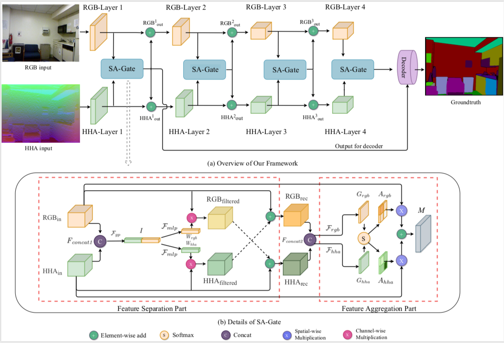
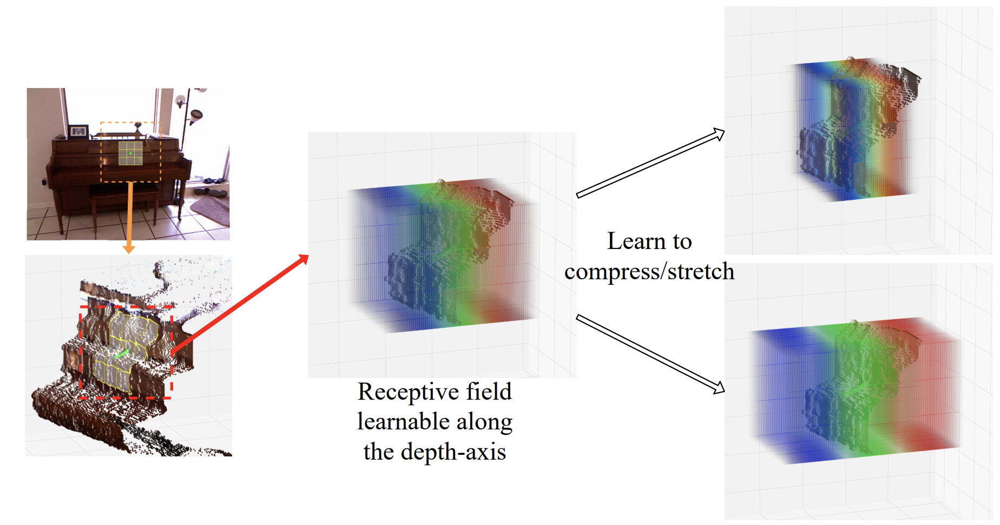

# RGBD_Semantic_Segmentation_PyTorch

 

Implement some state-of-the-art methods of RGBD Semantic Segmentation task in PyTorch.

Currently, we provide code of:

- **SA-Gate, ECCV 2020** [[arXiv](https://arxiv.org/abs/2007.09183)]
  
- **Malleable 2.5D Convolution, ECCV 2020** [[arXiv](https://arxiv.org/abs/2007.09365)]
  


## News

- 2020/08/16

Official code release for the paper **Malleable 2.5D Convolution: Learning Receptive Fields along the Depth-axis for RGB-D Scene Parsing**, *ECCV 2020*. [[arXiv](https://arxiv.org/abs/2007.09365)], [[code](./model/malleable2_5d.nyu.res101)]

Thanks [aurora95](https://github.com/aurora95) for his open source code!

- 2020/07/20

Official code release for the paper **Bi-directional Cross-Modality Feature Propagation with Separation-and-Aggregation Gate for RGB-D Semantic Segmentation**, *ECCV 2020*. [[arXiv](https://arxiv.org/abs/2007.09183)], [[code](./model/SA-Gate.nyu)]

​

## Main Results

#### Results on NYU Depth V2 Test Set with Multi-scale Inference

|       Method       | mIoU (%) |
| :----------------: | :------: |
|       3DGNN        |   43.1   |
|       ACNet        |   48.3   |
|     RDFNet-101     |   49.1   |
|       PADNet       |   50.2   |
|        PAP         |   50.4   |
| **Malleable 2.5D** | **50.9** |
|    **SA-Gate**     | **52.4** |

#### Results on CityScapes Test Set with Multi-scale Inference (out method uses output stride=16 and does not use coarse-labeled data)

|   Method    | mIoU (%) |
| :---------: | :------: |
|   PADNet    |   80.3   |
|    DANet    |   81.5   |
|    GALD     |   81.8   |
|   ACFNet    |   81.8   |
| **SA-Gate** | **82.8** |

For more details, please refer to our paper.

​

## Directory Tree

Your directory tree should look like this:

```
./
|-- furnace
|-- model
|-- DATA
-- |-- pytorch-weight
-- |-- NYUDepthv2
   |   |-- ColoredLabel
   |   |-- Depth
   |   |-- HHA
   |   |-- Label
   |   |-- RGB
   |   |-- test.txt
   |   |-- train.txt
```


## Installation

The code is developed using Python 3.6 with PyTorch 1.0.0. The code is developed and tested using 4 or 8 NVIDIA TITAN V GPU cards. You can change the `input size (image_height and image_width)` or `batch_size` in the `config.py` according to your available resources.

1. **Clone this repo.**

   ```shell
   $ git clone https://github.com/charlesCXK/RGBD_Semantic_Segmentation_PyTorch.git
   $ cd RGBD_Semantic_Segmentation_PyTorch
   ```

2. **Install dependencies.**

   **(1) Create a conda environment:**

   ```shell
   $ conda env create -f rgbd.yaml
   $ conda activate rgbd
   ```

   **(2) Install apex 0.1(needs CUDA)**

   ```shell
   $ cd ./furnace/apex
   $ python setup.py install --cpp_ext --cuda_ext
   ```

​

## Data preparation

#### Pretrained ResNet-101

Please download the pretrained ResNet-101 and then put it into `./DATA/pytorch-weight`.

|    Source    |                   Link                   |
| :----------: | :--------------------------------------: |
| BaiDu Cloud  | Link: https://pan.baidu.com/s/1Zc_ed9zdgzHiIkARp2tCcw Password: f3ew |
| Google Drive | https://drive.google.com/drive/folders/1_1HpmoCsshNCMQdXhSNOq8Y-deIDcbKS?usp=sharing |

#### NYU Depth V2

You could download the official NYU Depth V2 data [here](https://cs.nyu.edu/~silberman/datasets/nyu_depth_v2.html). After downloading the official data, you should modify them according to the structure of directories we provide. We also provide the processed data. *We will delete the link at any time if the owner of NYU Depth V2 requests*.

|    Source    |                   Link                   |
| :----------: | :--------------------------------------: |
| BaiDu Cloud  | Link: https://pan.baidu.com/s/1iU8m20Jv9shG_wEvwpwSOQ Password: 27uj |
| Google Drive | https://drive.google.com/drive/folders/1_1HpmoCsshNCMQdXhSNOq8Y-deIDcbKS?usp=sharing |

#### How to generate HHA maps?

If you want to generate HHA maps from Depth maps, please refer to [https://github.com/charlesCXK/Depth2HHA-python](https://github.com/charlesCXK/Depth2HHA-python).

​

## Training and Inference

*We just take SA-Gate as an example. You could run other models in a similar way.*

### Training

Training on NYU Depth V2:

```shell
$ cd ./model/SA-Gate.nyu
$ export NGPUS=8
$ python -m torch.distributed.launch --nproc_per_node=$NGPUS train.py
```

If you only have 4 GPU cards, you could:

```shell
$ cd ./model/SA-Gate.nyu.432
$ export NGPUS=4
$ python -m torch.distributed.launch --nproc_per_node=$NGPUS train.py
```

- Note that the only difference between `SA-Gate.nyu/` and `SA-Gate.nyu.432/` is the training/inference image crop size.
- The tensorboard file is saved in `log/tb/` directory.

### Inference

Inference on NYU Depth V2:

```shell
$ cd ./model/SA-Gate.nyu
$ python eval.py -e 300-400 -d 0-7 --save_path results
```

- Here, 300-400 means we evaluate on checkpoints whose ID is in [300, 400], such as epoch-300.pth, epoch-310.pth, etc. 
- The segmentation predictions will be saved in `results/` and `results_color/`, the former stores the original predictions and the latter stores colored version. Performance in mIoU will be written to `log/*.log`. You will expect ~51.4% mIoU in SA-Gate.nyu and ~51.5% mIoU in SA-Gate.nyu.432. (single scale inference with no flip)
- For **multi-scale and flip inference**, please set `C.eval_flip = True` and `C.eval_scale_array = [1, 0.75, 1.25]` in the `config.py`. Different `eval_scale_array` may have different performances.

​

## Citation

Please consider citing this project in your publications if it helps your research.

```tex
@inproceedings{chen2020-SAGate,
  title={Bi-directional Cross-Modality Feature Propagation with Separation-and-Aggregation Gate for RGB-D Semantic Segmentation},
  author={Chen, Xiaokang and Lin, Kwan-Yee and Wang, Jingbo and Wu, Wayne and Qian, Chen and Li, Hongsheng and Zeng, Gang},
  booktitle={European Conference on Computer Vision (ECCV)},
  year={2020}
}
```

```tex
@inproceedings{xing2020-melleable,
  title={Malleable 2.5D Convolution: Learning Receptive Fields along the Depth-axis for RGB-D Scene Parsing
},
  author={Xing, Yajie and Wang, Jingbo and Zeng, Gang},
  booktitle={European Conference on Computer Vision (ECCV)},
  year={2020}
}
```


## Acknowledgement

Thanks [TorchSeg](https://github.com/ycszen/TorchSeg) for their excellent project!

​

## TODO

- [ ] More encoders such as HRNet.
- [ ] Code and data for Cityscapes.
- [ ] More RGBD Semantic Segmentation models